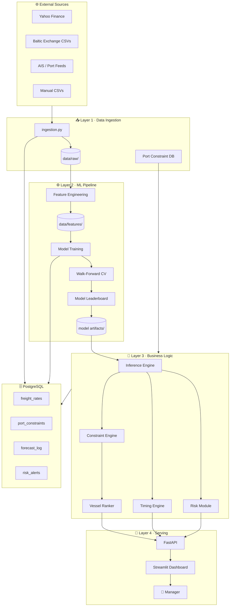
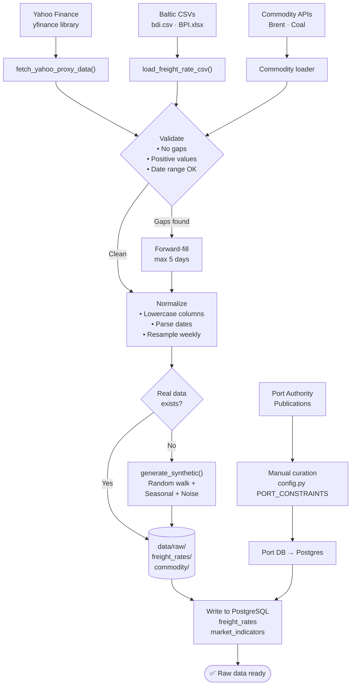
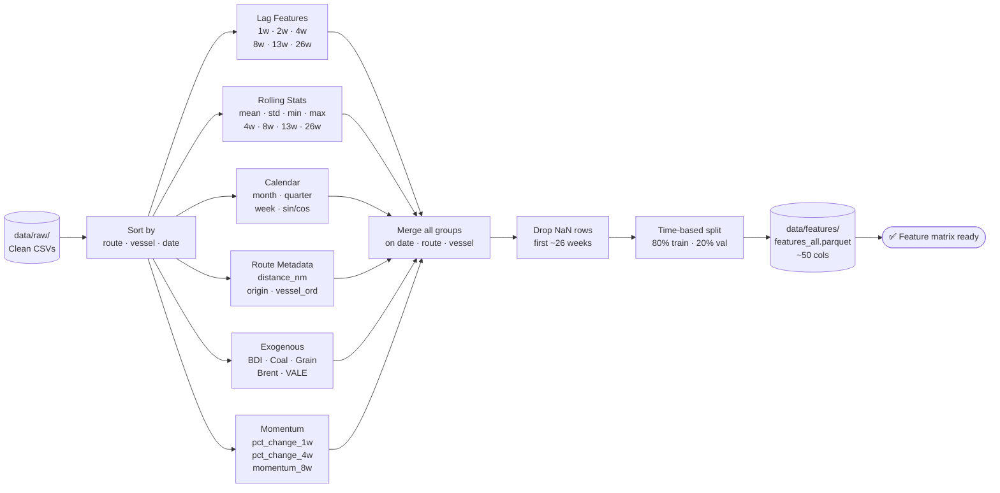
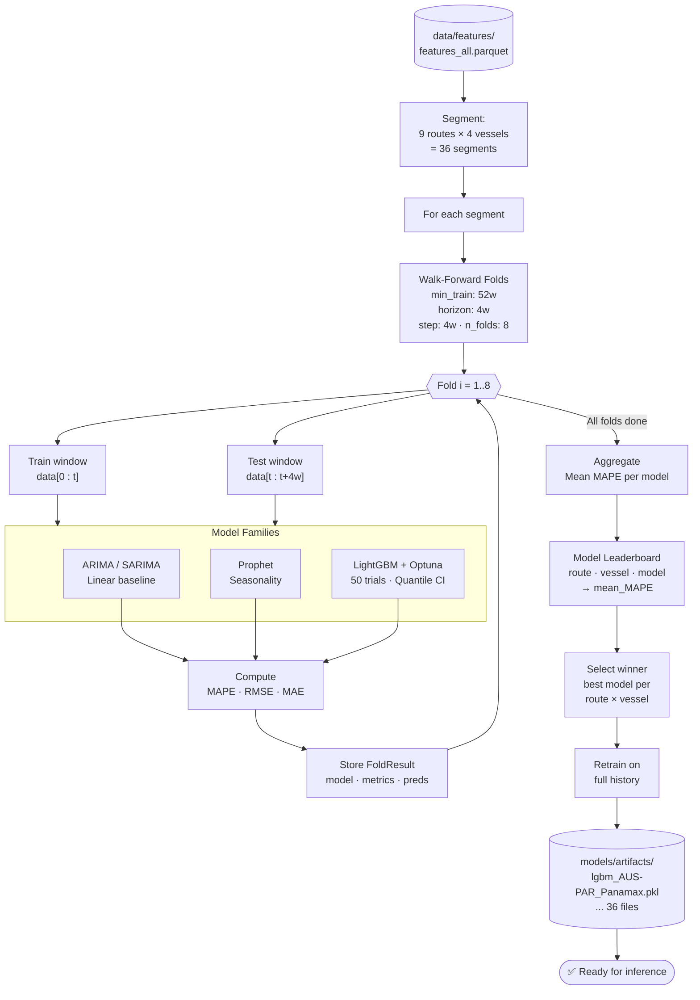
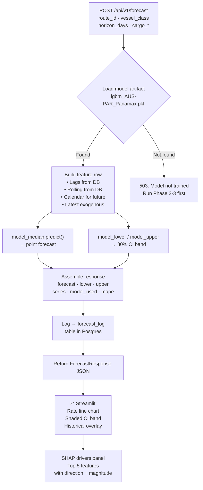
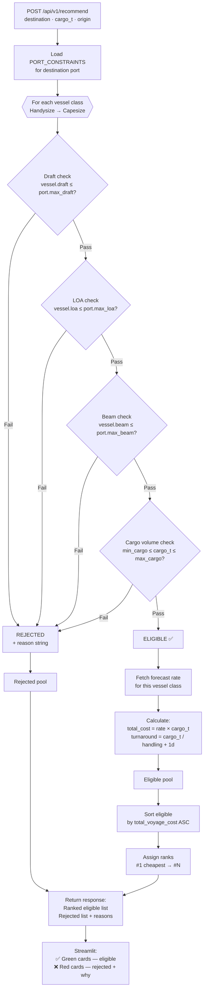
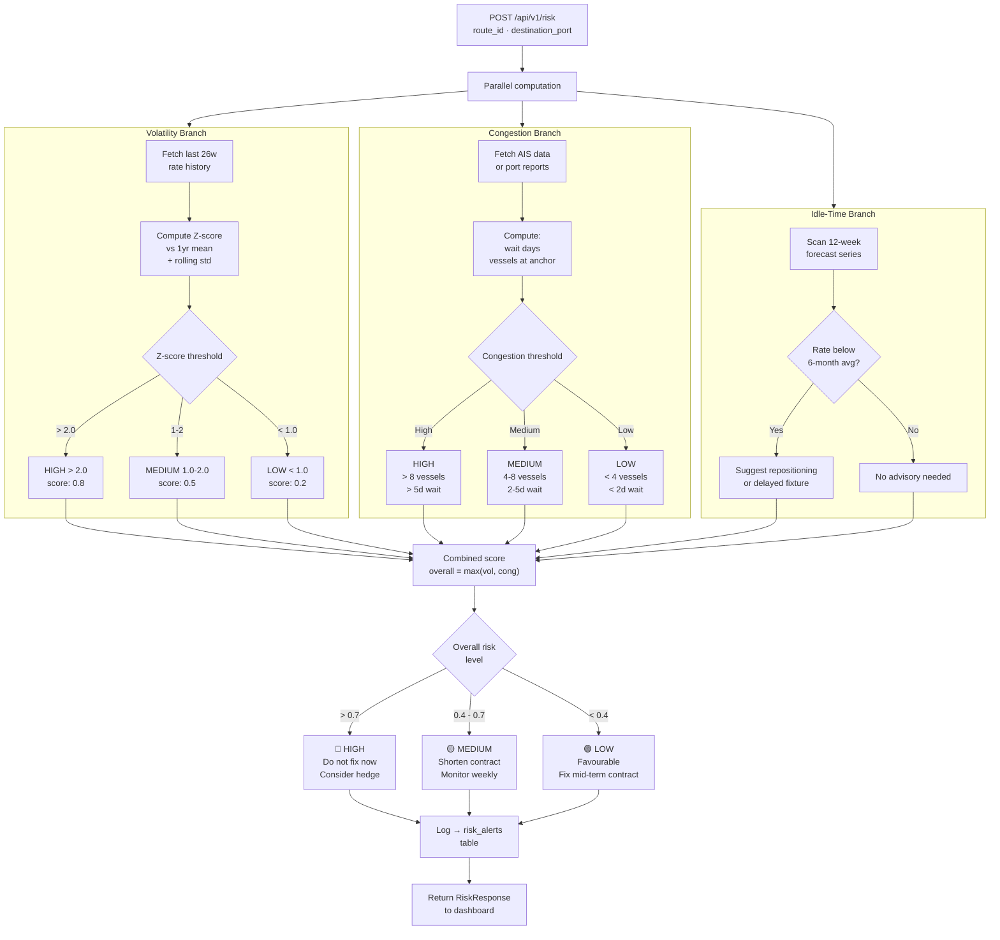
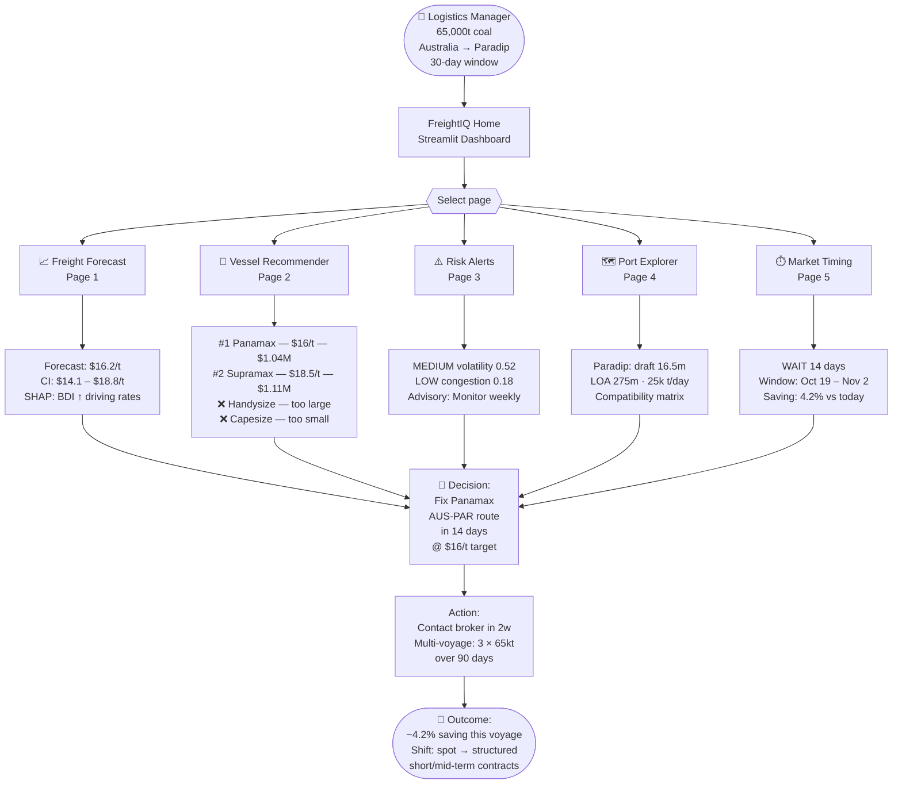
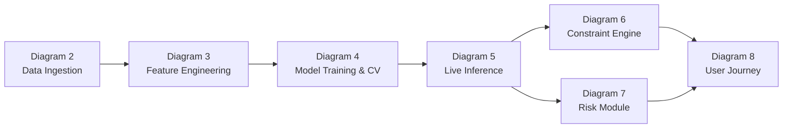

# 🏗️ SIH26006 — System Architecture & Flow Diagrams

> 8 detailed flow diagrams — node labels kept short to prevent clipping.  
> Full detail is in the written explanation beneath each diagram.

---

## Diagram 1 — High-Level System Architecture

### How the layers connect

**Layer 1 — Data Ingestion** is the entry point for everything external. `ingestion.py` fetches Yahoo Finance proxies (BDRY, BTU, VALE, WEAT, BZ=F), loads any manual Baltic Exchange CSVs, and receives AIS congestion signals. The Port Constraint DB (draft, LOA, beam values for all 7 East Coast ports) is curated separately and fed directly into Layer 3. All raw data lands in `data/raw/` and is mirrored into PostgreSQL.

**Layer 2 — ML Pipeline** transforms raw data into trained model artifacts. Feature engineering builds a 50+ column matrix (lags, rolling stats, calendar, exogenous indicators). Three model families are trained per route × vessel class (36 combinations total). Walk-forward cross-validation compares them and a leaderboard picks the winner. The winning model is retrained on all data and serialized to `models/artifacts/`.

**Layer 3 — Business Logic** is the intelligence core. The Inference Engine loads the right artifact and produces a forecast with confidence intervals. The Constraint Engine filters vessel classes against port physical limits. The Vessel Ranker orders eligible vessels by cost. The Risk Module scores volatility and congestion. The Timing Engine scans forecast troughs to recommend FIX vs WAIT.

**Layer 4 — Serving** exposes everything via FastAPI (5 REST endpoints) consumed by Streamlit (5 dashboard pages). The logistics manager interacts only with the Streamlit UI — all complexity is hidden.

---

## Diagram 2 — Data Ingestion Pipeline

### Step-by-step — Data Ingestion

**Step 1 — Source fetch.** `yfinance` downloads BDRY (BDI proxy ETF), BTU (coal), VALE (iron ore / dry-bulk demand), WEAT (grain), and BZ=F (Brent crude). These are all free, no API key required — critical for the development phase when paid Baltic Exchange data is unavailable. Any manual Baltic CSVs (bdi.csv, BPI.xlsx from the reference repos) are loaded with `load_freight_rate_csv()`.

**Step 2 — Validation.** Each fetched series is checked for: date continuity (no unexpected gaps longer than 5 days), positive non-zero rate values (a zero freight rate is always a data error), and adequate historical depth (minimum 3 years needed for seasonal model training).

**Step 3 — Forward-fill.** Freight rates on weekends and public holidays are not updated — the last known rate persists. Forward-filling up to 5 consecutive days is safe and standard practice for shipping indices.

**Step 4 — Normalization.** Columns are lowercased and underscored. All time series are resampled to weekly Monday frequency — this creates a unified time grid so that when freight rates and commodity indicators are merged later, they align exactly.

**Step 5 — Synthetic fallback.** If real data is missing (common in early Phase 1), `generate_synthetic_freight_rates()` creates a plausible series using a random walk for autocorrelation, a sine wave for annual seasonality, and Gaussian noise for volatility. Rates are clipped to realistic $5–$80/tonne bounds.

**Step 6 — Persistence.** Every cleaned dataset is written to `data/raw/` as CSV and simultaneously inserted into PostgreSQL. A UNIQUE constraint on (date, route_id, vessel_class) prevents duplicate rows on re-runs.

---

## Diagram 3 — Feature Engineering Pipeline

### Step-by-step — Feature Engineering

**Why group-wise operations?** All lag and rolling computations are done `groupby(['route_id', 'vessel_class'])` — the lag_1 for Australia-Paradip Panamax only looks back at that specific route's history. Mixing routes would cause contamination (an Indonesian rate spike would wrongly influence the Australian route model).

**Lag features (F1).** Six lag depths (1, 2, 4, 8, 13, 26 weeks) capture the strong autocorrelation of freight rates. BDI typically has a 4–8 week autocorrelation window. The 26-week lag (half-year) captures the semi-annual coal demand cycle.

**Rolling statistics (F2).** Rolling means tell the model what "regime" the market is in — a rising 8-week mean suggests a bull trend. Rolling standard deviation is critical for the risk module — it directly quantifies recent market volatility.

**Calendar features (F3).** Month and week_of_year are encoded as sin/cos pairs (cyclical encoding) so the model knows December and January are adjacent, not numerically far apart (12 vs 1). Q4 dummies capture the coal demand peak from power utilities pre-winter.

**Cyclical encoding detail:** `month_sin = sin(2π × month / 12)`, `month_cos = cos(2π × month / 12)`. This maps months onto a circle so distance between month 12 and month 1 is small, matching real seasonality.

**Route metadata (F4).** Sailing distance (nautical miles) is a fundamental cost driver — longer routes consume more fuel, making rates more sensitive to Brent price movements. Vessel class ordinal (0=Handysize → 3=Capesize) lets the model learn that Capesize rate dynamics differ fundamentally from Handysize.

**Exogenous signals (F5).** These are the "why" behind rate movements: BDI/BDRY captures overall market direction; Brent crude proxies fuel cost (60–70% of voyage cost); coal and iron ore prices proxy demand; grain proxies alternative cargo competition for vessel capacity.

**Momentum (F6).** Rate-of-change features capture acceleration — whether rates are speeding up or slowing down. The 8-week momentum (`rate / 8w_avg - 1`) tells the model if the market is stretched relative to its recent average — useful for timing.

**NaN drop.** The first ~26 rows of each group have NaN lags (no history before the series starts). These are dropped — they cannot be used for training.

**Time-safe split.** Training data is always strictly earlier than validation data. Random splitting is forbidden for time series — it allows the model to learn from the future, producing falsely optimistic metrics.

---

## Diagram 4 — Model Training & Backtesting Engine

### Step-by-step — Model Training & Backtesting

**36 independent models.** One model is trained per (route_id, vessel_class) pair. Australia-Paradip Panamax has completely different rate dynamics (long haul, weather-sensitive, AUD/USD influenced) vs Indonesia-Haldia Handysize (short haul, tidal restrictions, high frequency). A single global model would underfit both. 9 routes × 4 vessel classes = 36 model slots.

**Walk-forward fold generation.** The `WalkForwardBacktester` uses an expanding training window: Fold 1 trains on weeks 1–52 and tests on 53–56. Fold 2 trains on weeks 1–56 and tests on 57–60. Each fold advances by 4 weeks (`step_weeks=4`). This mimics real production — you always train on the past and predict forward. 8 folds × 4 weeks = 32 weeks of out-of-sample evaluation per segment.

**ARIMA/SARIMA.** Captures linear autoregressive patterns (today's rate depends on last week's rate). Fast to train, interpretable. If ARIMA wins the leaderboard for a route, it signals that route's rates are driven primarily by their own momentum — common for the relatively stable Indonesia short-haul routes.

**Prophet.** Facebook's time-series library handles trend changepoints (e.g., a COVID disruption mid-history) and strong weekly/annual seasonality without manual specification. It's robust to missing dates and outliers. Wins when seasonality dominates over exogenous signals.

**LightGBM + Optuna.** The power model. Ingests all 50+ features. Optuna runs 50 Bayesian hyperparameter trials (num_leaves, learning_rate, subsample, reg_alpha, etc.) minimizing MAPE on an inner time-split. Also trains quantile regression variants at α=0.1 and α=0.9 to produce the 80% confidence band. Typically wins when exogenous signals (BDI, Brent) have strong explanatory power.

**Model leaderboard.** Each model's MAPE is averaged across 8 folds per segment. Averaging eliminates lucky/unlucky single-fold results. The model with the lowest mean MAPE per (route, vessel_class) is declared the winner.

**Final retraining.** The winner is retrained on ALL available historical data — not just the training folds — before serialization. This maximizes information used for production inference. The final `.pkl` artifact is stored in `models/artifacts/`.

---

## Diagram 5 — Live Forecasting & Inference Flow

### Step-by-step — Live Inference

**Feature construction at inference time.** The model needs a feature row representing the world "as of today, looking forward." Lag values (rate_lag_1w through rate_lag_26w) are computed from the last 26 weeks of the `freight_rates` PostgreSQL table. Calendar features are computed for each future forecast date in the horizon. The latest BDI/Brent/commodity values are pulled from `market_indicators`. This produces a DataFrame with the exact same column schema the model was trained on.

**Two-pass inference.** The median model (MSE/MAPE objective) gives the central rate estimate — the "most likely" outcome. The quantile models (α=0.1, α=0.9, trained during Phase 3) give the lower and upper bounds of the 80% confidence interval. A wide CI (e.g., $14–$27/tonne) signals high uncertainty; a narrow CI (e.g., $16–$18/tonne) signals a stable, predictable market.

**What the CI means operationally.** If the forecast is $16.2/t and the CI is $14.1–$18.8/t, the manager knows there is an 80% probability the actual rate will land in that range. This directly informs contract strategy: wide CI → fix a shorter contract to avoid being locked in at a bad rate. Narrow CI → safe to commit to a longer multi-voyage contract.

**SHAP explanations.** SHAP (SHapley Additive exPlanations) decomposes each prediction into the marginal contribution of each feature. The dashboard renders this in plain English: "BDI rose 8% this week → pushes rate up $1.2/t" rather than raw shap values. This is essential — logistics managers need to understand and explain the recommendation to their management.

**Audit log.** Every inference call is logged to `forecast_log` with full request parameters, model name, and historical MAPE. This creates an audit trail for model drift detection — if observed rates consistently fall outside the CI, the model needs retraining.

---

## Diagram 6 — Vessel-Port Constraint Engine & Ranker

### Step-by-step — Constraint Engine & Vessel Ranker

**The constraint filter is a hard gate.** A vessel that cannot physically berth at the port is not just inefficient — it is an operational failure. The ship would need to anchor offshore and wait (idle time at ~$10,000–$20,000/day charter cost) or be replaced entirely.

**Check 1 — Draft.** The vessel's loaded draft (depth below waterline when carrying full cargo) must not exceed the port's maximum allowable draft. This is the most common binding constraint for East Coast Indian ports. Haldia (8.0m) and Sagar-Sandheads (8.5m) are tidal river ports — they eliminate Supramax, Panamax, and Capesize entirely. Only Paradip (16.5m) and Vizag (16.5m) can handle Capesize vessels.

**Check 2 — LOA (Length Overall).** The vessel must physically fit within the port's maximum berth or channel length. A 290m Capesize cannot berth at a 200m facility like Gopalpur.

**Check 3 — Beam.** The vessel's width must fit within the port's channel and berth width. Less frequently the binding constraint in open ports, but critical at narrow river ports and some private berths.

**Check 4 — Cargo volume compatibility.** The cargo parcel must fit within the vessel's practical cargo range (min to max DWT adjusted for vessel efficiency). Loading 65,000t on a Handysize (max 35,000t) physically requires two vessels or two voyages. Loading 65,000t on a Capesize (min 90,000t) means the ship sails 30% under-loaded, drastically inflating cost-per-tonne. Both are valid operational scenarios but outside the scope of a single-vessel single-voyage recommendation.

**Ranking logic.** After the filter, eligible vessels are sorted by total voyage cost (forecast_rate × cargo_volume_t). This is the primary optimization axis. Turnaround time (days) is shown as secondary information — faster turnaround releases the vessel earlier for the next voyage, which matters for multi-voyage scheduling where vessels are on consecutive hire.

**Paradip example with 65,000t cargo:** Handysize rejected (max 35,000t — cargo too large for one vessel). Capesize rejected (min 90,000t — cargo too small to load efficiently). Supramax and Panamax are both eligible. Panamax wins on total cost at ~$16/t ($1.04M total) vs Supramax at ~$18.5/t ($1.11M total), saving $70,000 on a single voyage.

---

## Diagram 7 — Risk & Idle-Time Advisory Module

### Step-by-step — Risk & Idle-Time Advisory

**Three independent analysis branches run in parallel** — volatility, congestion, and idle-time. Each produces an independent score and advisory. The system is designed this way because each risk type has a different data source, different threshold logic, and a different operational response.

**Volatility branch.** The module fetches the last 26 weeks of rate history for the route from PostgreSQL. It computes the Z-score: `(current_rate - 1yr_mean) / 1yr_std`. A Z-score above 2.0 means rates are more than 2 standard deviations above their historical norm — a classic "overbought" condition in freight markets, historically preceding a sharp correction. Fixing a 6-month contract at a Z-score of 2.5 is high risk. Rolling standard deviation is also computed as a raw volatility measure — useful for options-style hedging decisions.

**Congestion branch.** Port congestion directly converts to idle time cost. A vessel waiting at anchor costs $8,000–$20,000/day in hire depending on vessel class and charter type. The module uses AIS vessel-count data near port coordinates — the number of vessels at anchor and average waiting days are the key inputs. During development, this can be proxied from published weekly port reports. Berth utilization (vessels waiting / total berths) is a secondary indicator.

**Idle-time branch.** The 12-week forecast series is scanned for periods where projected rates fall below the 6-month historical average — these are the low-demand windows. During such periods, the advisory module suggests: (1) repositioning the vessel to an alternative loading port to position for the next demand surge rather than sitting idle at an East Coast Indian anchorage; (2) delaying the fixture by 2–4 weeks to avoid the trough; or (3) considering a ballast voyage to a higher-demand region.

**Combined risk score.** The final overall risk is `max(volatility_score, congestion_score)` — not an average. Either risk type alone is sufficient to recommend caution. A low-volatility market with a severely congested port (e.g., Haldia in monsoon season) is just as operationally dangerous as a high-volatility market with clear ports.

**Actionable outputs.** HIGH (>0.7): do not commit to a contract without a freight derivative hedge (e.g., Forward Freight Agreement). MEDIUM (0.4–0.7): shorten contract duration from 6-month to 1-month to limit rate exposure. LOW (<0.4): good conditions for the target multi-voyage mid-term contract.

---

## Diagram 8 — End-to-End User Decision Journey

### Step-by-step — End-to-End User Journey

**The starting context.** The logistics manager has a concrete operational need: move 65,000 tonnes of coal from Australia to Paradip within 30 days. In the current approach, they would call their broker every morning to check the spot rate and make a decision based on today's quote alone. With FreightIQ, one session replaces days of reactive monitoring.

**Page 1 — Freight Forecast.** The manager enters route AUS-PAR, vessel class Panamax, 30-day horizon. The system returns $16.2/t as the forecast with an $14.1–$18.8/t confidence interval. The SHAP panel shows the top driver is a recent BDI rise (up 8%), followed by Q4 seasonal coal demand. Critically, the CI tells the manager not just the expected rate but how certain the model is — influencing whether to fix now or wait.

**Page 2 — Vessel Recommender.** Entering destination Paradip and 65,000t cargo, the engine runs all 4 vessel classes through the constraint filter. Handysize is rejected (max cargo 35,000t — the 65kt parcel is too large for a single vessel). Capesize is rejected (minimum efficient load 90,000t — 65kt underloads the vessel by 28%, massively inflating $/tonne). Supramax and Panamax are both eligible. Panamax ranks first at $1.04M total voyage cost vs Supramax at $1.11M — a $70,000 saving on one voyage.

**Page 3 — Risk Alerts.** Before committing, the manager checks the risk dashboard. MEDIUM volatility (Z-score 0.9, not alarming) and LOW congestion at Paradip means: proceed with caution, but don't fix a 6-month contract — keep this short-term. The advisory is explicit: "Monitor BDI movements weekly before committing beyond 30 days."

**Page 4 — Port Explorer.** The manager verifies Paradip's constraints: 16.5m max draft (Panamax at 14.0m fits with 2.5m safety margin), 275m max LOA, 25,000 t/day handling rate (65,000t cargo → 2.6 days discharge plus 1 day overhead = 3.6 days turnaround). This verification step replaces a call to the operations team.

**Page 5 — Market Timing.** This is the strategic core. The system recommends WAIT — specifically a 14-day delay targeting the window October 19 – November 2, where the forecast shows a rate trough. Expected saving: 4.2% vs fixing today at $16.2/t, which translates to approximately $43,680 on this single voyage. Over 12 such voyages per year, consistent timing optimization compounds into significant annual savings.

**The strategic shift.** The manager places an order with their broker in 14 days — not for a single voyage spot contract, but for a 3-voyage multi-voyage commitment (3 × 65,000t over 90 days). This is precisely the SIH26006 objective: from reactive daily spot-fixing to proactive planned multi-voyage contracting.

---

## Summary Map

